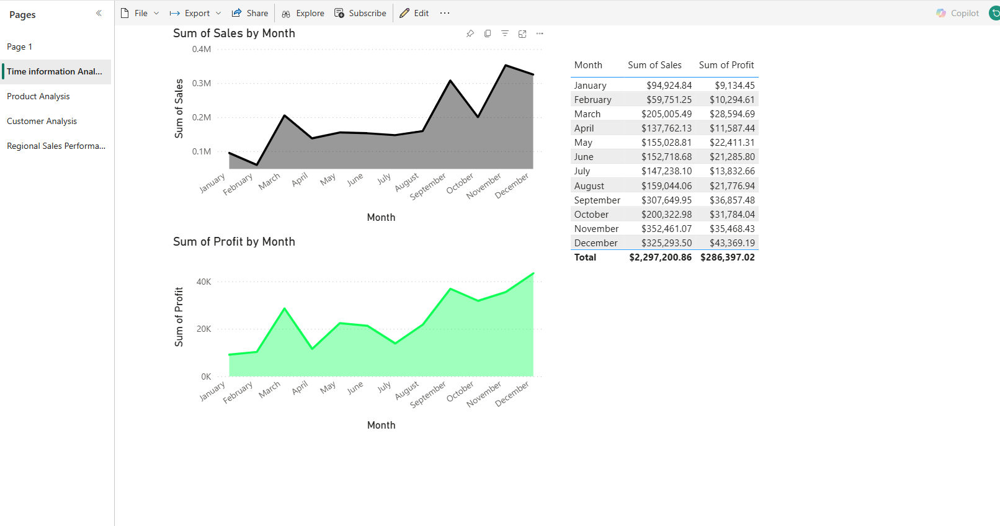
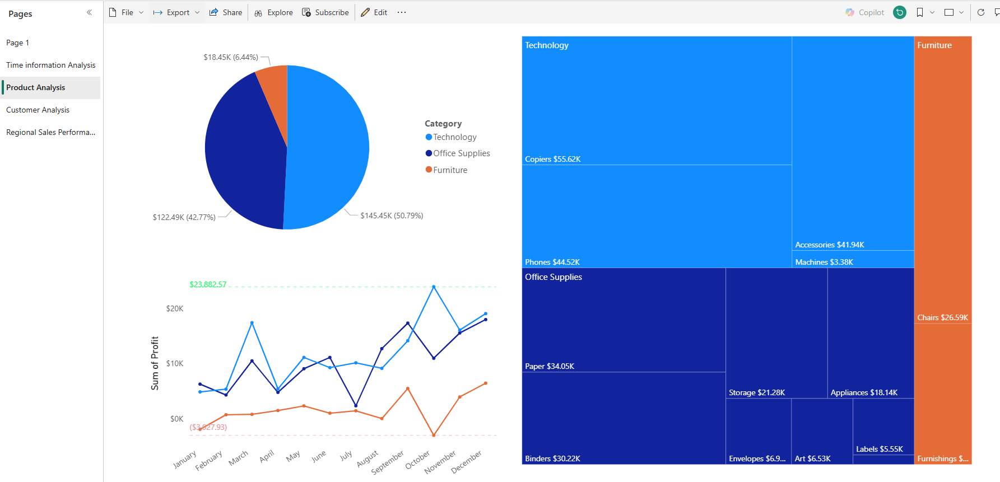
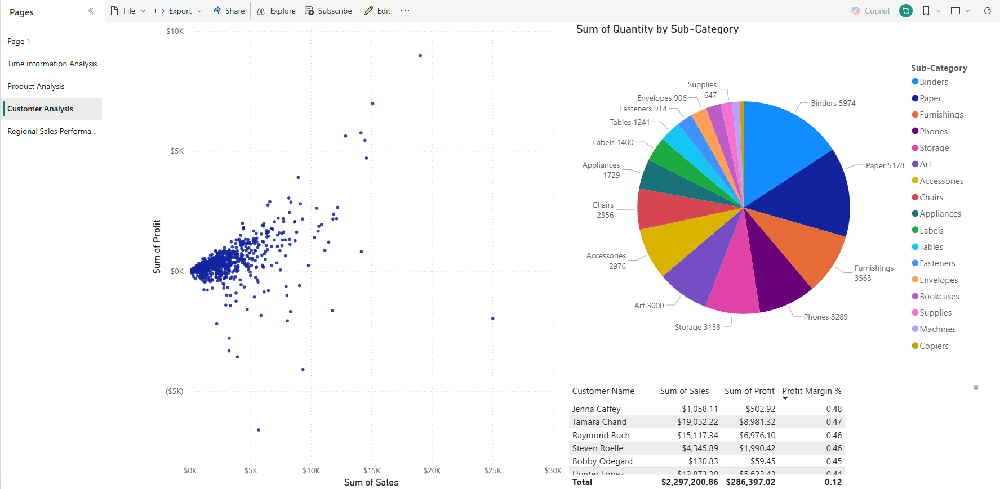
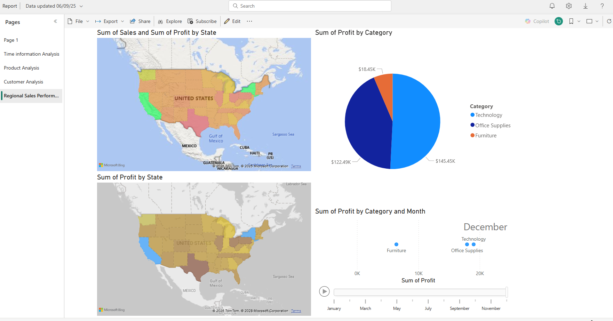

# GreenMart-Sales-Dashboard
Power BI dashboard analysing 2017 GreenMart sales data, including time trends, product performance, customer insights, and regional sales analysis.

📊 **Interactive Data Dashboard in Power BI**  
This project simulates work as a data analyst at **GreenMart**, a company specializing in eco-friendly office supplies and furniture.  

The goal was to build a **comprehensive sales dashboard** to uncover insights on:
- Sales trends over time
- Product category & sub-category performance
- Customer purchase behavior
- Regional sales & profit variations

---

## 🛠️ Process
1. **Data Cleaning & Preparation**
   - Converted columns to correct data types (currency, numbers, dates).
   - Filtered dataset to focus on **2017 transactions only**.
   - Ensured data consistency for categories and subcategories.

2. **Dashboard Design**
   - **Time Analysis**: Monthly sales & profit trends.
   - **Product Analysis**: Category performance, profit by sub-category.
   - **Customer Analysis**: Scatterplots of sales vs. profit, customer segmentation.
   - **Regional Analysis**: Maps showing profit & sales distribution across US states.

---

## 📸 Screenshots
*(Interactive link will be added later)*

### Time Information Analysis

### Product Analysis

### Customer Analysis

### Regional Sales Performance

---

## 🚀 How to Use
- Download the `.pbix` file from this repo.
- Open it with **Power BI Desktop** (free from Microsoft).
- Explore the interactive dashboards.

---

## 🌐 Live Dashboard
🔗 *Coming soon – interactive Power BI link will be added here*

---

## 📈 Key Insights
- **Sales grew steadily** towards the end of 2017, with December as the peak month.
- **Technology products** were the top revenue driver, but **Furniture** had negative profit margins in some states.
- **Regional differences** showed that some states consistently underperformed in profit, despite high sales.
- A small number of **loyal customers** contributed significantly to sales volume.

---

## 🔑 Skills Demonstrated
- Data Cleaning & Transformation in Power BI
- Building Multi-page Dashboards
- DAX basics for measures
- Business Insight Communication
- Data Visualization Design

